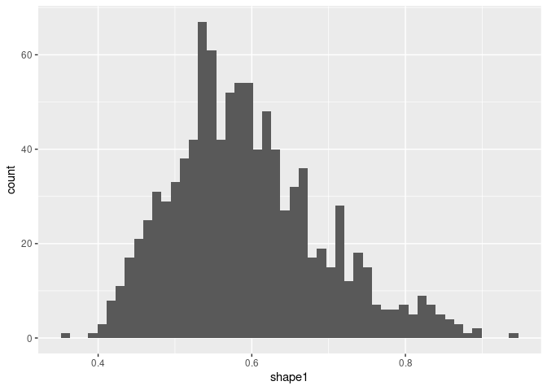
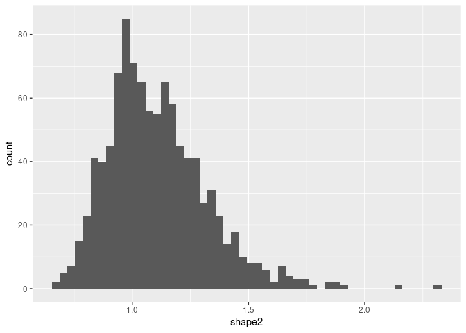
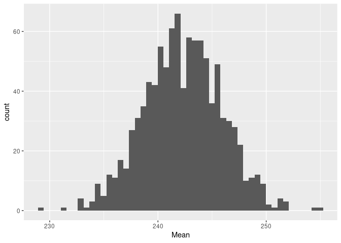

Home office equipment load
================

Quick notebook to calculate the mean load of home office equipment,
given some survey samples. First Load libraries

``` r
library(tidyverse)
library(tidymodels)
library(fitdistrplus)
```

We can use the `plotdist` function to view the historgram and
probability density of the UK home worker office loads.

``` r
plotdist(ukOfficeLoads$load, histo = TRUE, demp = TRUE)
```

<!-- -->
Looks like it could be modelled as a beta distribution. In order to fit
the survey data to a beta distribution we must normalise data to a range
of \[0,1\].

``` r
min_max <- function(x) {
  (x - min(x) + 0.001) / (max(x) - min(x) + 0.002)
}

loadNorm <- min_max(ukOfficeLoads$load)

fit1 <- fitdist(loadNorm, "beta")

plot(fit1)
```

<!-- -->

``` r
summary(fit1)
```

    ## Fitting of the distribution ' beta ' by maximum likelihood 
    ## Parameters : 
    ##         estimate Std. Error
    ## shape1 0.5680658 0.08784244
    ## shape2 1.0412189 0.18581753
    ## Loglikelihood:  13.07545   AIC:  -22.1509   BIC:  -17.89664 
    ## Correlation matrix:
    ##           shape1    shape2
    ## shape1 1.0000000 0.5760633
    ## shape2 0.5760633 1.0000000

In order to find a good fit, we can bootstrap the sample data to
generate a sampling mean for the distribution shape parameters, together
with confidence intervals.

``` r
b1 <- bootdist(fit1, niter = 1000)
plot(b1, enhance=TRUE)
```

<!-- -->

``` r
summary(b1)
```

    ## Parametric bootstrap medians and 95% percentile CI 
    ##           Median      2.5%     97.5%
    ## shape1 0.5808916 0.4364633 0.8259517
    ## shape2 1.0748221 0.7808285 1.6258531

Plot the distribution of bootstrap results for both shape parameters

``` r
alpha <- b1$estim[1]
beta  <- b1$estim[2]

alpha %>%
  ggplot(aes(x=shape1)) +
  geom_histogram(bins=50)
```

<!-- -->

``` r
beta %>%
  ggplot(aes(x=shape2)) +
  geom_histogram(bins=50)
```

<!-- -->

Having bootstraped the distribution fit shape parameters, plot the
fitted distribution.

``` r
# Function to denormalise data
rescale <- function(x,min_load, max_load){
  x_rescaled = x * (max_load - min_load) + min_load 
}

max_load <- max(ukOfficeLoads$load)
min_load <- min(ukOfficeLoads$load)

# Distribution shape parameters
alpha <- b1$fitpart$estimate[1]
beta  <- b1$fitpart$estimate[2]

# generate distribution data to plot
x_seq <- seq(0,1,by=0.01)
probability_density <- dbeta(x_seq, alpha, beta)
load <- map(x_seq,~rescale(.x,min_load, max_load))
loadDistribtuion <- data.frame(load = unlist(load),prob = probability_density) 

# Plot load distribution
loadDistribtuion %>%
  ggplot(aes(x=load,y=probability_density)) + 
  geom_line() +
  theme_bw()
```

<!-- -->
Now we can use this distribution to generate 1000 samples via a
bootstrap (repeated a 1000 times)

``` r
set.seed(42)
samples <- rbeta(1000,alpha,beta) %>% 
  as.data.frame() %>%
  set_names(c("load")) %>%
  map_dfr(~rescale(.x, min_load, max_load))

# Create bootstrapped samples
set.seed(42)
boots <- bootstraps(samples, times=1000, apparent = F) %>%
  mutate(splits = map(splits, analysis)) %>%
  unnest(splits)

# Calculate sampling means and CI
samplingMeans <- boots %>%
  group_by(id) %>%
  summarise(ci = list(enframe(Hmisc::smean.cl.normal(load)))) %>%
  unnest() %>%
  spread(name,value)
```

    ## Warning: `cols` is now required when using unnest().
    ## Please use `cols = c(ci)`

``` r
# Plot a histogram
samplingMeans %>%
  ggplot(aes(x=Mean)) +
  geom_histogram(bins=50)
```

<!-- -->

The mode is around 240W. Let’s calculate the mean and the associated
confidence intervals.

``` r
samplingMeans %>%
  summarise(lower = mean(Lower), mean = mean(Mean), upper = mean(Upper))
```

    ## # A tibble: 1 × 3
    ##   lower  mean upper
    ##   <dbl> <dbl> <dbl>
    ## 1  235.  242.  249.

The average power for home working equipment is 242W (5th percentile=
235W, 95th percentile = 249W).
